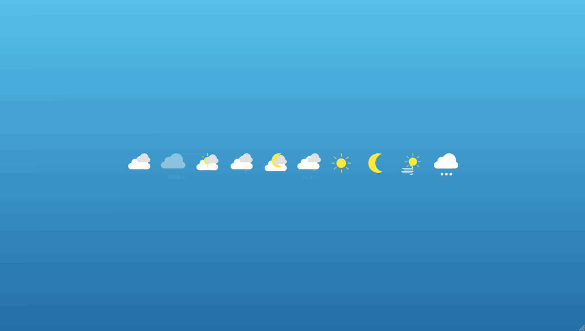
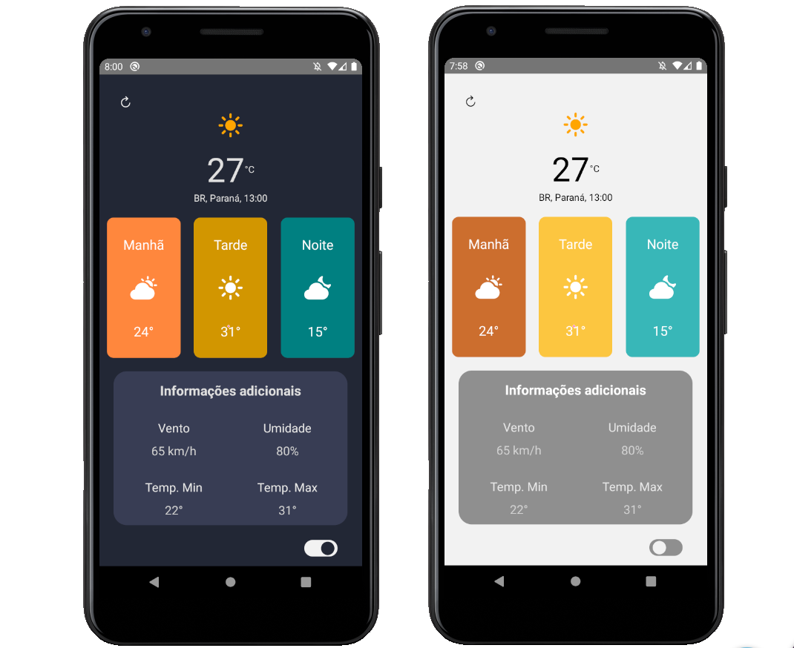
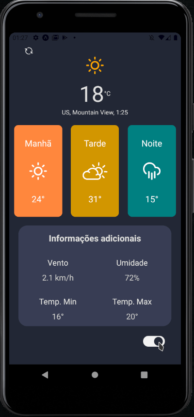

# WeatherApp - Expo


> Aplicação mobile que realiza consulta em tempo real à uma API de previsão do tempo.

<div width="800px" height="100px">
    
</div>

## Apicação desenvolvida para fins de estudo.
<div align="center">
    
</div>

<hr>
<div align="center">
    
</div>

## :sparkles: Tecnologias:

[React-Native](https://reactnative.dev/)
| [Expo](https://expo.io/)
| [Axios](https://github.com/axios/axios)


<div align="center" name="prints_proj">
    
    
    
</div>

## 💻 Instalação

* É necessário ter instalado em seu computador o **Node.js** e o **Expo** (Caso você não possua link logo abaixo)

    - [Node.js](https://nodejs.org/en/)
    - [Expo](https://expo.io/)

* Faça o clone do projetos no local desejado.
    ```sh
        git clone https://github.com/Alencar26/WeatherAppExpo.git
    ```
<br>

* Na raiz do projeto execute
    ```sh
        yarn start
        #ou
        expo start
    ```  
<br>

# Creditos:
Projeto de autoria de:

- [Youtube - 
Clewerton Roque](https://www.youtube.com/watch?v=Ia5zW8wkAdI)
- [Github - Clewerton Roque](https://github.com/clewertonx1/WeatherApp)

ps: Tutorial no canal do youtube acima.

<div align="center">
    
</div>

# LICENCE

<br>
Projeto sob licença <a href="./LICENSE">MIT.</a>